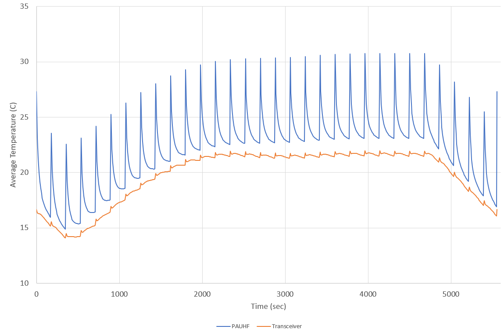
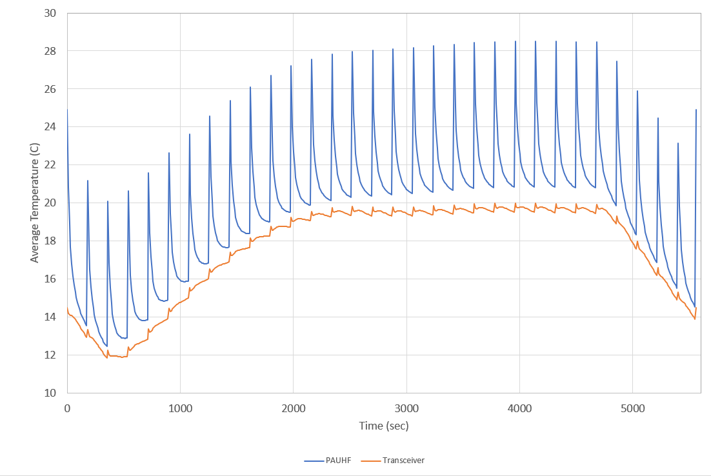
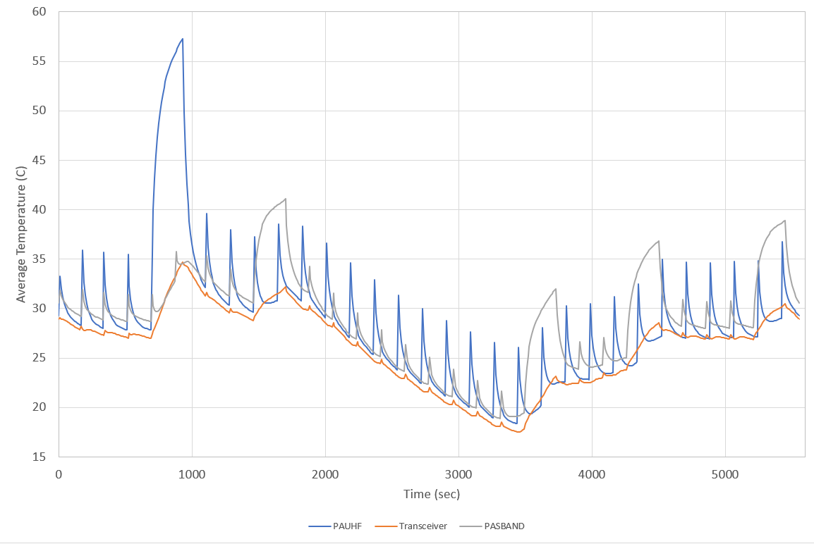
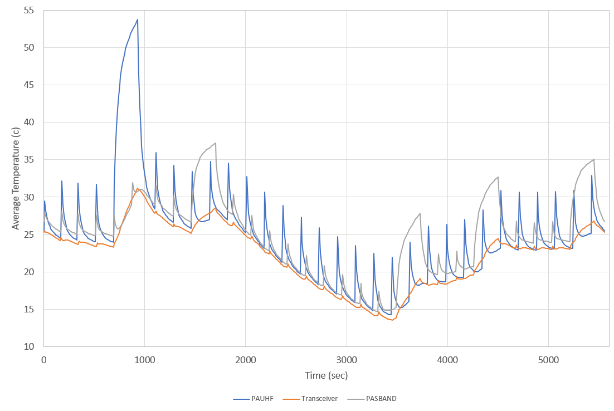
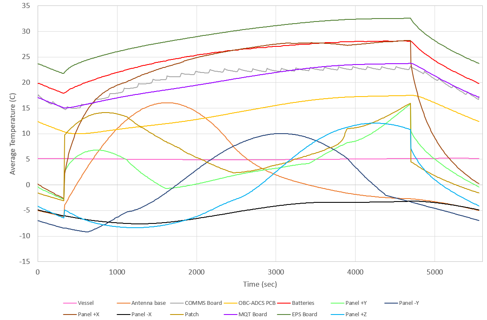
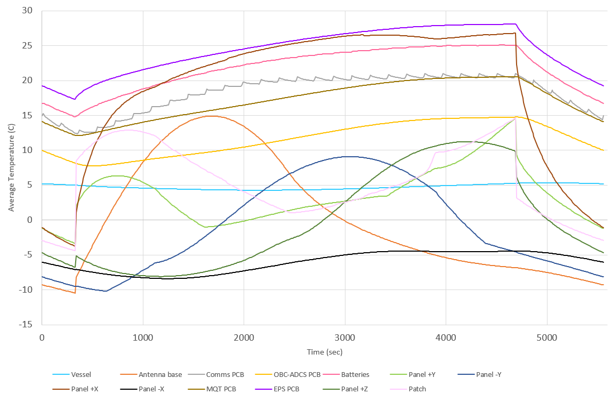
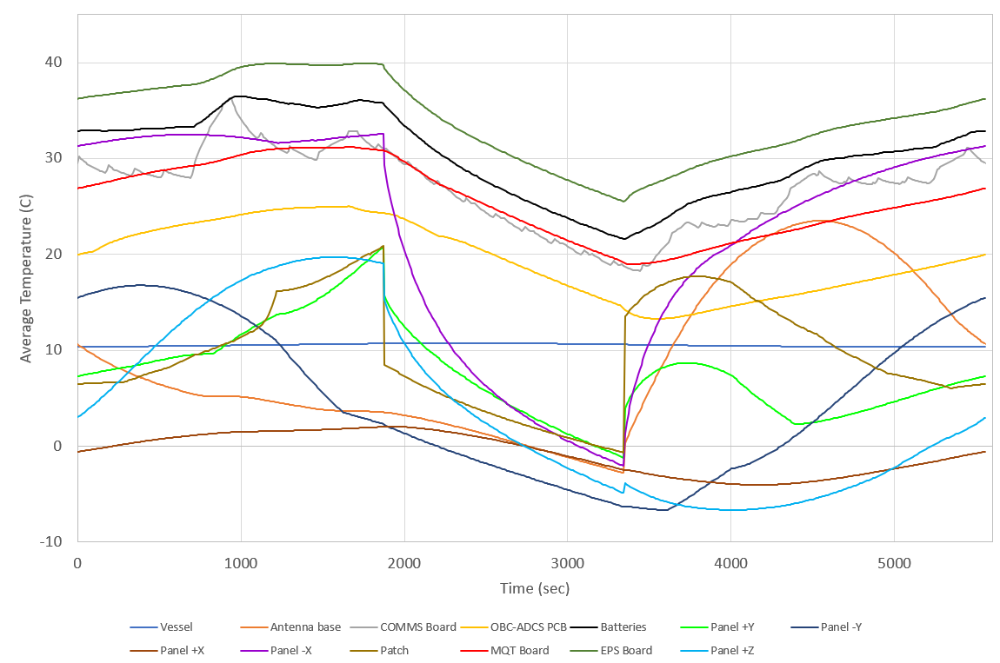
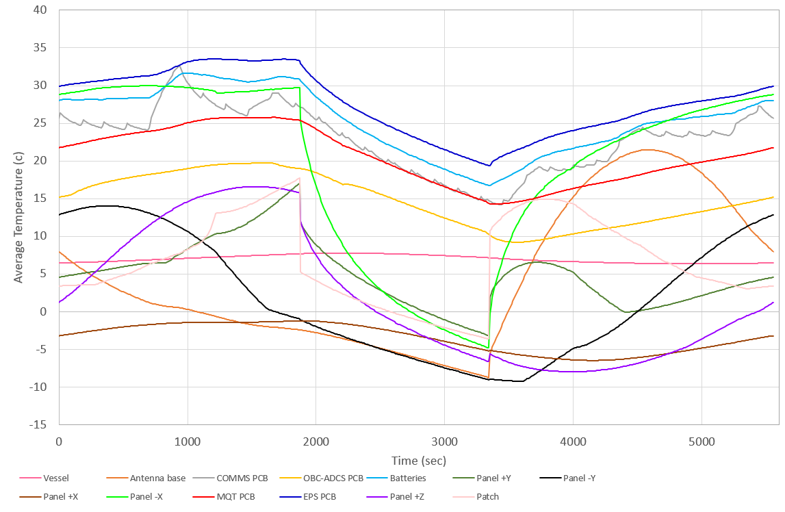

    <a href="https://gitlab.com/acubesat/documentation/cdr-public/-/blob/master/DDJF/DDJF_THR_ARPT.pdf">DDJF_THR 📚🧪</a> &bull;
    <a href="https://spacedot.gr/">SpaceDot 🌌🪐</a> &bull;
    <a href="https://acubesat.spacedot.gr/">AcubeSAT 🛰️🌎</a>

## Description

Coming soon :tm:!

## Table of Contents

Click to expand

[[_TOC_]]

## Results

### Plots

#### COMMS PCB

[][https://gitlab.com/acubesat/thermal/esatan-model/-/blob/master/cdr/plots/comms-pcb/cold-with-passive-control.png]

---

[][https://gitlab.com/acubesat/thermal/esatan-model/-/blob/master/cdr/plots/comms-pcb/cold-without-passive-control.png]

---

[][https://gitlab.com/acubesat/thermal/esatan-model/-/blob/master/cdr/plots/comms-pcb/hot-with-passive-control.png]

---

[][https://gitlab.com/acubesat/thermal/esatan-model/-/blob/master/cdr/plots/comms-pcb/hot-without-passive-control.png]

#### General

[][https://gitlab.com/acubesat/thermal/esatan-model/-/blob/master/cdr/plots/general/cold-with-passive-control.png]

---

[][https://gitlab.com/acubesat/thermal/esatan-model/-/blob/master/cdr/plots/general/cold-without-passive-control.png]

---

[][https://gitlab.com/acubesat/thermal/esatan-model/-/blob/master/cdr/plots/general/hot-with-passive-control.png]

---

[][https://gitlab.com/acubesat/thermal/esatan-model/-/blob/master/cdr/plots/general/hot-without-passive-control.png]

## Model

The model files reside inside the `model/` directory. The files are:
- `cdr.ere`: Thermal cases
- `cdr.erg`: Model geometry
- `cdr.erk`: Radiative cases
- `cdr.xml`: Chart data

To import the model in ESATAN-TMS, open the software, then go to `File` -> `Import` -> `Geometry` and import the geometry file (`cdr.erg`). Afterwards, a model entry will be created in ESATAN-TMS, and you can go to `File` -> `Import` -> `Chart data` AND/OR `Radiative` AND/OR `Thermal` to import the rest, respectively. Just note that you have to import the geometry file first.
